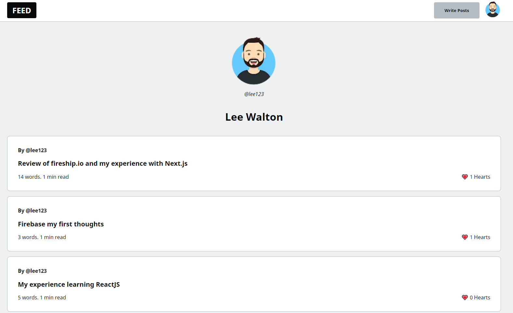

# Next Firebase Blog

[]()

## Details

- Clone of dev.to built using next.js and firebase. 
- Use of SSR to generate content on the sevrer.
- SEO optimised using SSR and metatags.
- Login managed using google oauth.
- Posts written in markdown and html generated for front end.
- Images stored in firebase.
- ISR used to incrementally load succsessive pages of posts on client side.
- Page 1 loaded on server.


## Data structure

```
{
    content: "## post content here",
    createdAt: "31 August 2021 at 04:59:43 UTC+1",
    heartCount: 0,
    published: true,
    slug: "post-title-here",
    title: "New post for blog",
    uid: "",
    updatedAt: "31 August 2021 at 04:59:43 UTC+1",
    username: "lee",
}
```

## Technologies used

-   Next.js
-   Firebase Storage
-   Firebase Database
-   Firebase Authentication

## Hosted at

-   Vercel cloud deployment

## Setup

To run this project, install it locally using npm:

```bash
$ cd ../lorem
$ npm install
$ npm run dev
#or
yarn dev
```

## Page preview


